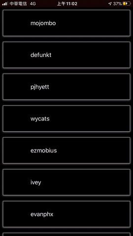

# GithubOpenData

## You can get Giuhub users list by this APP

## Summary
* Use MVVM architecture
* Use 3rd party libs. Alamofire for network request. MBProgressHUD for showing HUD.
* Checkout users list
* Scroll to bottom will load more data
* Cache images
* Checkout specify user's detail
* Checkout user's blog in Safari APP
